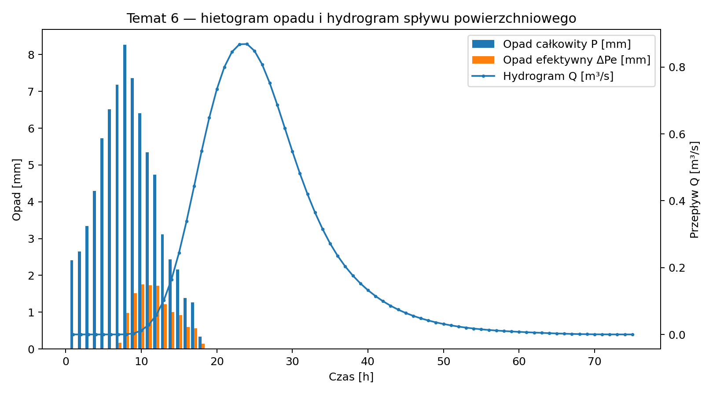

# Zadanie – Obliczanie spływu powierzchniowego metodą SCS-CN-UH  
## Wariant 6 – Zlewnia mozaikowa z terenami sukcesji roślinnej

---

### Aleksander Sarzyniak 188843

### Wiktor Leszczyński 188731

---

## Część 1. Obliczenie CN

### Przyjęte wartości CN

| CLC | CN |
|---|---:|
| 324 (B) | 56 |
| 211 (C) | 85 |
| 243 (B) | 69 |
| 311 (A) | 30 |
| 231 (C) | 74 |

### Obliczenia

| CLC | Powierzchnia | CN | CN·F |
|---|---:|---:|---:|
| 324 | 0.90 | 56 | 50.40 |
| 211 | 1.20 | 85 | 102.00 |
| 243 | 0.85 | 69 | 58.65 |
| 311 | 0.70 | 30 | 21.00 |
| 231 | 0.60 | 74 | 44.40 |
| **Suma** | **4.25** |   | **276.45** |

$$
CN_{\mathrm{sr}} = \frac{276.45}{4.25} = 65.047 \approx 65.0
$$

### Wniosek
Największy wpływ na wzrost CN mają grunty orne (CLC 211) oraz łąki i pastwiska (CLC 231). Lasy liściaste (CLC 311) obniżają wartość CN.

---

## Część 2. Opad efektywny

### Parametry

$$
S = \frac{25400}{CN} - 254 = 136.49\ \mathrm{mm}
$$

$$
I_a = 0.2S = 27.30\ \mathrm{mm}
$$

### Opad (seria S6)

| Godz. | P [mm] | P skum. | Pe skum. | dPe |
|---:|---:|---:|---:|---:|
| 1 | 2.41 | 2.41 | 0.00 | 0.00 |
| 2 | 2.65 | 5.06 | 0.00 | 0.00 |
| 3 | 3.34 | 8.40 | 0.00 | 0.00 |
| 4 | 4.29 | 12.69 | 0.00 | 0.00 |
| 5 | 5.73 | 18.42 | 0.00 | 0.00 |
| 6 | 6.52 | 24.94 | 0.00 | 0.00 |
| 7 | 7.18 | 32.12 | 0.16 | 0.16 |
| 8 | 8.27 | 40.39 | 1.15 | 0.98 |
| 9 | 7.36 | 47.75 | 2.67 | 1.52 |
| 10 | 6.41 | 54.16 | 4.42 | 1.75 |
| 11 | 5.35 | 59.51 | 6.15 | 1.73 |
| 12 | 4.74 | 64.25 | 7.87 | 1.72 |
| 13 | 3.12 | 67.37 | 9.10 | 1.22 |
| 14 | 2.43 | 69.80 | 10.09 | 1.00 |
| 15 | 2.16 | 71.96 | 11.01 | 0.92 |
| 16 | 1.38 | 73.34 | 11.61 | 0.60 |
| 17 | 1.27 | 74.61 | 12.18 | 0.56 |
| 18 | 0.33 | 74.94 | 12.33 | 0.15 |

### Wyniki

- Suma opadu: **74.94 mm**
- Suma opadu efektywnego: **12.33 mm**

---

## 3. Obliczenie hydrogramu jednostkowego SCS UH

$$
t_{\mathrm{lag}} = 0.6T_c
$$

$$
t_{\mathrm{lag}} = 0.6 \cdot 18 = 10.8\ \mathrm{h}
$$

$$
T_p = \frac{\Delta t}{2} + t_{\mathrm{lag}}
$$

$$
T_p = \frac{1}{2} + 10.8 = 11.3\ \mathrm{h}
$$

$$
q_p = \frac{0.208A}{T_p}
$$

$$
q_p = \frac{0.208 \cdot 4.25}{11.3} = 0.0782\ \mathrm{m^3\,s^{-1}\,mm^{-1}}
$$

Hydrogram końcowy uzyskano przez superpozycję hydrogramów jednostkowych przemnożonych przez godzinowe przyrosty opadu efektywnego $\Delta P_e$.

$$
Q_{\max} = 0.87\ \mathrm{m^3\,s^{-1}}
$$

Kulminacja:

$$
t = 24\ \mathrm{h}
$$

### Tabela hydrogramu końcowego

 
| t [h] | P [mm] | $\Delta P_e$ [mm] | Q [m³/s] |
|--------:|---------:|-----------:|-----------:|
|   1.000 |    2.410 |      0.000 |      0.000 |
|   2.000 |    2.650 |      0.000 |      0.000 |
|   3.000 |    3.340 |      0.000 |      0.000 |
|   4.000 |    4.290 |      0.000 |      0.000 |
|   5.000 |    5.730 |      0.000 |      0.000 |
|   6.000 |    6.520 |      0.000 |      0.000 |
|   7.000 |    7.180 |      0.165 |      0.000 |
|   8.000 |    8.270 |      0.981 |      0.000 |
|   9.000 |    7.360 |      1.519 |      0.003 |
|  10.000 |    6.410 |      1.752 |      0.012 |
|  11.000 |    5.350 |      1.733 |      0.029 |
|  12.000 |    4.740 |      1.722 |      0.058 |
|  13.000 |    3.120 |      1.222 |      0.103 |
|  14.000 |    2.430 |      0.998 |      0.165 |
|  15.000 |    2.160 |      0.919 |      0.244 |
|  16.000 |    1.380 |      0.603 |      0.339 |
|  17.000 |    1.270 |      0.565 |      0.444 |
|  18.000 |    0.330 |      0.148 |      0.549 |
|  19.000 |    0.000 |      0.000 |      0.648 |
|  20.000 |    0.000 |      0.000 |      0.733 |
|  21.000 |    0.000 |      0.000 |      0.800 |
|  22.000 |    0.000 |      0.000 |      0.845 |
|  23.000 |    0.000 |      0.000 |      0.868 |
|  24.000 |    0.000 |      0.000 |      0.869 |
|  25.000 |    0.000 |      0.000 |      0.848 |
|  26.000 |    0.000 |      0.000 |      0.808 |
|  27.000 |    0.000 |      0.000 |      0.752 |
|  28.000 |    0.000 |      0.000 |      0.687 |
|  29.000 |    0.000 |      0.000 |      0.618 |
|  30.000 |    0.000 |      0.000 |      0.548 |
|  31.000 |    0.000 |      0.000 |      0.481 |
|  32.000 |    0.000 |      0.000 |      0.420 |
|  33.000 |    0.000 |      0.000 |      0.365 |
|  34.000 |    0.000 |      0.000 |      0.315 |
|  35.000 |    0.000 |      0.000 |      0.272 |
|  36.000 |    0.000 |      0.000 |      0.235 |
|  37.000 |    0.000 |      0.000 |      0.203 |
|  38.000 |    0.000 |      0.000 |      0.176 |
|  39.000 |    0.000 |      0.000 |      0.153 |
|  40.000 |    0.000 |      0.000 |      0.132 |
|  41.000 |    0.000 |      0.000 |      0.115 |
|  42.000 |    0.000 |      0.000 |      0.099 |
|  43.000 |    0.000 |      0.000 |      0.086 |
|  44.000 |    0.000 |      0.000 |      0.074 |
|  45.000 |    0.000 |      0.000 |      0.064 |
|  46.000 |    0.000 |      0.000 |      0.056 |
|  47.000 |    0.000 |      0.000 |      0.048 |
|  48.000 |    0.000 |      0.000 |      0.042 |
|  49.000 |    0.000 |      0.000 |      0.036 |
|  50.000 |    0.000 |      0.000 |      0.031 |
|  51.000 |    0.000 |      0.000 |      0.027 |
|  52.000 |    0.000 |      0.000 |      0.023 |
|  53.000 |    0.000 |      0.000 |      0.020 |
|  54.000 |    0.000 |      0.000 |      0.018 |
|  55.000 |    0.000 |      0.000 |      0.015 |
|  56.000 |    0.000 |      0.000 |      0.013 |
|  57.000 |    0.000 |      0.000 |      0.012 |
|  58.000 |    0.000 |      0.000 |      0.010 |
|  59.000 |    0.000 |      0.000 |      0.009 |
|  60.000 |    0.000 |      0.000 |      0.008 |
|  61.000 |    0.000 |      0.000 |      0.007 |
|  62.000 |    0.000 |      0.000 |      0.006 |
|  63.000 |    0.000 |      0.000 |      0.005 |
|  64.000 |    0.000 |      0.000 |      0.004 |
|  65.000 |    0.000 |      0.000 |      0.003 |
|  66.000 |    0.000 |      0.000 |      0.002 |
|  67.000 |    0.000 |      0.000 |      0.002 |
|  68.000 |    0.000 |      0.000 |      0.001 |
|  69.000 |    0.000 |      0.000 |      0.001 |
|  70.000 |    0.000 |      0.000 |      0.000 |
|  71.000 |    0.000 |      0.000 |      0.000 |
|  72.000 |    0.000 |      0.000 |      0.000 |
|  73.000 |    0.000 |      0.000 |      0.000 |
|  74.000 |    0.000 |      0.000 |      0.000 |
|  75.000 |    0.000 |      0.000 |      0.000 |
 